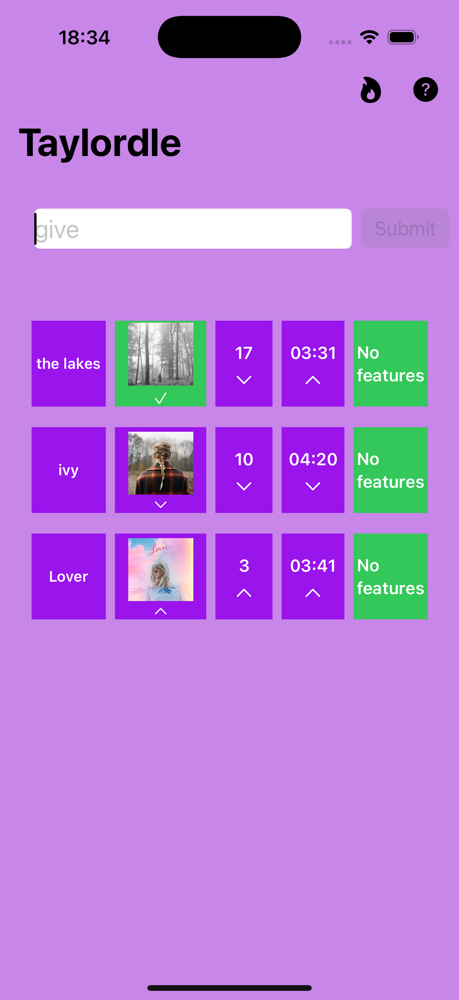
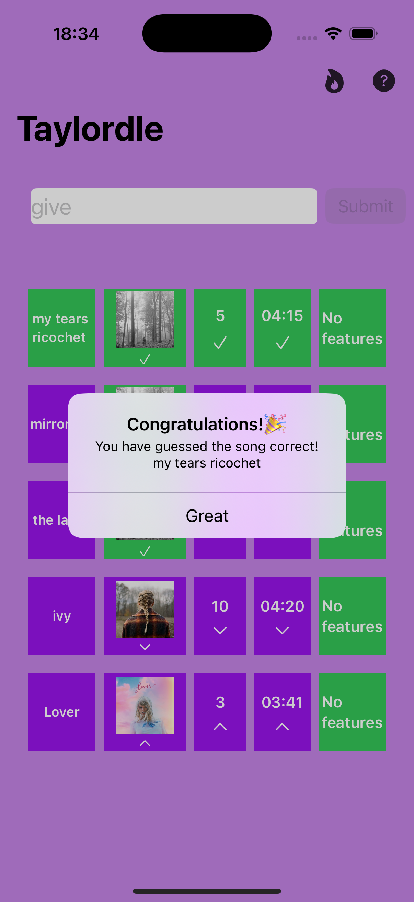
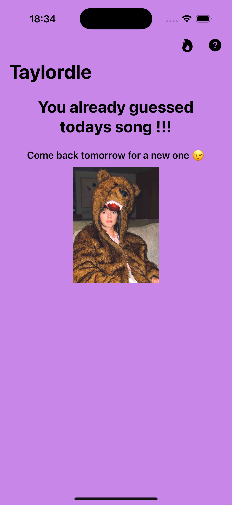
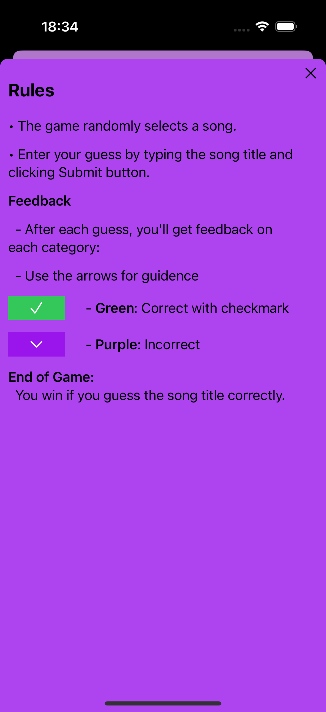

# Taylordle

Taylordle is a fun, daily guessing game for Taylor Swift fans, inspired by Wordle. In Taylordle, players try to guess the Taylor Swift song of the day based on limited information. Each incorrect guess gives clues to help players get closer to the correct answer!

## Screenshots
|  |  |
| -------------------------------------------- | ------------------------------------------- |
| Gameplay Screen                               | Winning Screen                              |

|  |  |
| ----------------------------------------------- | ----------------------------------------------- |
| Already Guessed Screen                          | Rules Screen                                    |

## How to Play

1. **Guess the Song**: Type the title of a Taylor Swift song in the input box and press "Submit".
2. **Feedback on Each Guess**:
   - **Green Checkmark**: Correct in that category.
   - **Purple Arrow**: Incorrect in that category, use hints to adjust your guess.
3. **Categories**:
   - Album, track number, song length, and whether the song has any features.
4. **Win Condition**: Guess the song title correctly to win the game.
5. **One Guess per Day**: After winning or guessing the daily song, you’ll need to wait until the next day for a new song.

## Rules

- The game selects a random Taylor Swift song each day.
- Players can only guess once per day.

